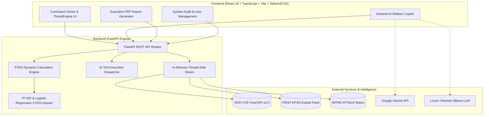

# 🛡️ ThreatLens.AI

> **Adaptive Vulnerability Prioritization Engine & Cyber Threat Intelligence Command Center**  
> *Empowering SOC analysts and CISOs to prioritize, triage, and remediate high-impact vulnerabilities using dynamic PSSS scoring, MITRE ATT&CK contextualization, and autonomous AI agents.*

---

[](https://fastapi.tiangolo.com)
[](https://react.dev)
[](https://www.typescriptlang.org)
[](https://vitejs.dev)
[](https://tailwindcss.com)
[](https://www.python.org)
[](https://ai.google.dev)
[](https://ollama.ai)
[](LICENSE)

---

## 📑 Table of Contents

- [Executive Summary](#-executive-summary)
- [Key Features](#-key-features)
- [Architecture & System Design](#-architecture--system-design)
- [The PSSS Scoring Formula](#-the-psss-scoring-formula)
- [Project Structure](#-project-structure)
- [Getting Started](#-getting-started)
  - [Prerequisites](#prerequisites)
  - [Environment Setup](#environment-setup)
  - [One-Click Launch](#one-click-launch)
  - [Manual Execution](#manual-execution)
- [Sentinel AI Copilot & Tool Calling](#-sentinel-ai-copilot--tool-calling)
- [REST API Reference](#-rest-api-reference)
- [License & Acknowledgements](#-license--acknowledgements)

---

## 🎯 Executive Summary

Modern cybersecurity teams face vulnerability alert fatigue. Traditional static scoring frameworks like **CVSS** measure severity in isolation without considering real-world exploitation probabilities (**EPSS**) or adversary tactics (**MITRE ATT&CK**).

**ThreatLens.AI** solves this by introducing the **Predictive Security Severity Score (PSSS)**: an adaptive, multi-variable ranking engine backed by Machine Learning imputation, threat actor telemetry, and an autonomous AI Copilot (**Sentinel AI**) capable of executing real-time remediation actions and mathematical weight recalibrations.

---

## ✨ Key Features

### 🎛️ 1. Vulnerability Command Center
- **Syncable Priority Queue**: Interactive vulnerability triage queue with jumbled initialization and one-click sorting by computed PSSS score.
- **Dynamic Filtering & Search**: Instant filtering by lifecycle status (`UNASSIGNED`, `IN_TRIAGE`, `REMEDIATION_PENDING`, `SUPPRESSED`, `RESOLVED`) and severity (`CRITICAL`, `HIGH`, `MEDIUM`, `LOW`).
- **Remediation & Ticket Dispatch**: Actionable remediation modals featuring command-line patch commands, affected cluster node counts, and integration for dispatching Jira / ServiceNow tickets.

### 🗺️ 2. ThreatEngine & Heatmap Analytics
- **MITRE ATT&CK Matrix Heatmap**: Interactive tactic heatmap with Seaborn-style colormaps (`YlOrRd`, `Viridis`, `Magma`, `Rocket`, `Coolwarm`), statistical interpolation, and metric modes (`PSSS`, `EPSS`, `CVSS`, `Exposure`).
- **Top CVE Rankings**: Interactive bar rankings with customizable bar limits, metric selectors, and visual themes (`Amber`, `Flame`, `Cyan`).
- **CIA Triad Impact Breakdown**: SVG pie charts and breakdown metrics quantifying the impact on **Confidentiality**, **Integrity**, and **Availability**.
- **APT Threat Actor Intelligence**: Detailed dossiers on advanced persistent threats (e.g., APT29 Cozy Bear, APT41 Brass Typhoon), target industries, associated CVEs, and one-click IOC clipboard copy.

### 🤖 3. Sentinel AI Autonomous Assistant
- **Dual AI Provider Architecture**: Seamlessly switch between **Google Gemini** (`gemini-2.5-flash`, `gemini-2.5-flash-lite`, `gemini-3.1-flash-lite`, `gemini-3-flash`) and **Ollama Local/Remote Models** (`llama3.2`, `qwen2.5`, `deepseek-r1`, `mistral`).
- **Autonomous Tool Execution**: Sentinel AI is equipped with function-calling capabilities to fetch vulnerabilities, update lifecycle statuses, modify severity/PSSS scores, recalibrate scoring weights, query pipeline health, and predict CVSS vectors from raw vulnerability descriptions.
- **Rich Markdown Formatting**: Generates GitHub-flavored tables, code blocks, structured headers, and interactive prompt shortcut chips.

### 📑 4. Executive & Operational PDF Intel Reports
- **Customizable Report Modules**: Selectable modules including PSSS Score Breakdown, Top Threat Vectors, MITRE ATT&CK Saturation, Remediation SLAs, and Active Adversary Campaigns.
- **Print-Ready Styling**: Dual-theme support with instant Dark Preview and Light Paper print stylesheet (`window.print()`).

### 🔒 5. Enterprise Governance & Telemetry
- **Role-Based Access Control (RBAC)**: User management interface with configurable roles (`CISO_ADMIN`, `TIER_3_LEAD`, etc.), MFA indicators, and permission toggles.
- **Audit Logging**: Comprehensive event tracking for formula weight overrides, status updates, and feed synchronizations with JSON payload modal inspection.
- **Data Pipeline Health**: Real-time status, record synchronization counts, and latency monitoring for NVD, EPSS, and MITRE data streams.

---

## 🏗️ Architecture & System Design



---

## 🧮 The PSSS Scoring Formula

$$
\text{PSSS} = \min\left(10.0, \max\left(0.0, \left(\alpha \cdot \frac{\text{CVSS}_{\text{base}}}{10.0} + \beta \cdot \text{EPSS} + \gamma \cdot \text{Criticality}_{\text{MITRE}}\right) \times 10.0\right)\right)
$$

### Default Weight Distribution
| Parameter | Symbol | Default Value | Description |
| :--- | :---: | :---: | :--- |
| **CVSS Base Weight** | $\alpha$ | `0.35` (35%) | Measures intrinsic technical severity and impact |
| **EPSS Exploit Weight** | $\beta$ | `0.45` (45%) | Measures empirical probability of exploitation in the wild |
| **ATT&CK Criticality** | $\gamma$ | `0.20` (20%) | Threat context boost for critical adversary tactics |
| **Threat Actor Multiplier** | $\mu$ | `1.25` | Multiplier applied when known APT campaigns actively target the CVE |

### Machine Learning Vector Imputer
When vulnerabilities lack published CVSS v3.1 vector strings, the backend ML pipeline employs **TF-IDF n-gram vectorization** combined with **Logistic Regression classifiers** trained on NVD datasets to predict missing metrics (`AV`, `AC`, `PR`, `UI`, `S`, `C`, `I`, `A`) and compute base scores on the fly.

---

## 📁 Project Structure

```
ThreatLens-AI/
├── backend/
│   ├── main.py                     # FastAPI application routes & middleware
│   ├── psss_engine.py              # PSSS formula engine & ML vector imputer
│   ├── tools.py                    # Autonomous AI tool schemas & execution logic
│   ├── requirements.txt            # Python dependencies
│   ├── nvdcve-2.0-modified.json    # NVD CVE vulnerability dataset
│   └── README.md                   # Backend specific documentation
├── frontend/
│   ├── src/
│   │   ├── api/                    # Axios API client & backend connectors
│   │   ├── assets/                 # Brand logos, icons, and SVG assets
│   │   ├── components/             # Reusable UI components
│   │   │   ├── AIChatSidebar.tsx   # Sentinel AI copilot (Gemini & Ollama)
│   │   │   ├── Header.tsx          # System health banner & notifications
│   │   │   ├── MetricCard.tsx      # Stat counters & metric widgets
│   │   │   ├── PsssBadge.tsx       # Dynamic severity & score badges
│   │   │   ├── RemediationModal.tsx# Triage workflow & ticket dispatch
│   │   │   ├── Sidebar.tsx         # Primary navigation sidebar
│   │   │   └── UserModal.tsx       # User permissions & RBAC editor
│   │   ├── planes/                 # Main application dashboard views
│   │   │   ├── CommandCenter.tsx   # Vulnerability triage queue & metrics
│   │   │   ├── ThreatEngine.tsx    # MITRE heatmap, CVE rank, CIA triad
│   │   │   ├── IntelReportGenerator.tsx # Print-ready PDF report builder
│   │   │   ├── SystemAudit.tsx     # Real-time event & audit log explorer
│   │   │   └── UserManagement.tsx  # User roles & permissions view
│   │   ├── types/                  # TypeScript interface & type definitions
│   │   ├── App.tsx                 # Root application container & plane routing
│   │   ├── index.css               # Cyberpunk design system & print styles
│   │   └── main.tsx                # React DOM entry point
│   ├── .env.example                # Template for frontend environment variables
│   ├── package.json                # Frontend dependencies & build scripts
│   ├── tsconfig.json               # TypeScript compiler configuration
│   └── vite.config.ts              # Vite bundler & backend proxy config
├── launch_local.sh                 # Local startup script (FastAPI + Vite)
├── launch.sh                       # Production/Demo startup script (with ngrok)
├── .gitignore                      # Git ignore patterns (protects .env & secrets)
└── README.md                       # Main repository documentation
```

---

## 🚀 Getting Started

### Prerequisites
- **Python**: `3.10` or higher
- **Node.js**: `18.x` or higher (`npm` included)
- **Git**: For version control

### Environment Setup

1. **Clone the Repository**:
   ```bash
   git clone https://github.com/shreyas23dev/ThreatLens-AI.git
   cd ThreatLens-AI
   ```

2. **Configure Frontend Environment**:
   Copy the example environment file and configure your Gemini API key (optional for local Ollama use):
   ```bash
   cp frontend/.env.example frontend/.env
   ```
   Edit `frontend/.env`:
   ```env
   VITE_GEMINI_API_KEY=your_gemini_api_key_here
   ```

3. **Install Backend Dependencies**:
   ```bash
   cd backend
   pip install -r requirements.txt
   cd ..
   ```

4. **Install Frontend Dependencies**:
   ```bash
   cd frontend
   npm install
   cd ..
   ```

---

### One-Click Launch

#### Local Mode (Recommended for Development)
Starts both the FastAPI backend (port `8000`) and the Vite React frontend (port `5173`):
```bash
chmod +x launch_local.sh
./launch_local.sh
```

- 🌐 **Web Dashboard**: [http://localhost:5173](http://localhost:5173)
- 🔌 **Backend API**: [http://localhost:8000](http://localhost:8000)
- 📚 **Swagger Docs**: [http://localhost:8000/docs](http://localhost:8000/docs)

#### Remote / Tunnel Mode (with ngrok)
```bash
chmod +x launch.sh
./launch.sh
```

---

### Manual Execution

If you prefer running services in separate terminal windows:

**Terminal 1 (Backend)**:
```bash
cd backend
python3 -m uvicorn main:app --host 0.0.0.0 --port 8000 --reload
```

**Terminal 2 (Frontend)**:
```bash
cd frontend
npm run dev
```

---

## 🤖 Sentinel AI Copilot & Tool Calling

Sentinel AI interacts directly with the live threat engine using automated function calling:

| Tool Name | Parameters | Description |
| :--- | :--- | :--- |
| `get_vulnerabilities` | `severity`, `status` | Fetches active CVEs filtered by severity or triage status |
| `get_random_nvd_cves` | `count`, `load_into_triage` | Ingests and prioritizes $N$ CVEs from the NVD dataset |
| `update_vulnerability_status` | `v_id`, `status` | Updates lifecycle status (`UNASSIGNED`, `IN_TRIAGE`, `RESOLVED`, etc.) |
| `update_vulnerability_priority` | `v_id`, `severity`, `psssScore` | Overrides priority rating or sets custom PSSS score |
| `get_threat_actors` | *none* | Fetches active threat actor profiles, IOCs, and target sectors |
| `get_audit_logs` | *none* | Queries system audit trail and security logs |
| `get_pipeline_health` | *none* | Checks NVD, EPSS, and MITRE data ingestion pipeline health |
| `get_scoring_weights` | *none* | Reads current PSSS formula weights ($\alpha, \beta, \gamma, \mu$) |
| `update_scoring_weights` | `cvssWeight`, `epssWeight`, etc. | Recalibrates scoring formula weights on the fly |
| `predict_cve_vector` | `text` | ML model predicts CVSS v3.1 metrics from raw vulnerability text |

---

## 📡 REST API Reference

| Method | Endpoint | Description |
| :--- | :--- | :--- |
| `GET` | `/` | Health check & API version status |
| `GET` | `/api/vulnerabilities` | Retrieve sorted vulnerability priority list |
| `PATCH` | `/api/vulnerabilities/{id}/status` | Update vulnerability lifecycle status |
| `PATCH` | `/api/vulnerabilities/{id}/priority` | Update severity level or PSSS score override |
| `GET` | `/api/threat-actors` | Fetch threat actor dossiers and IOCs |
| `GET` | `/api/audit-logs` | Retrieve recent administrative audit logs |
| `GET` | `/api/users` | List RBAC user accounts and permissions |
| `GET` | `/api/pipeline/health` | Telemetry health metrics for data ingestion feeds |
| `GET` | `/api/weights` | Retrieve current PSSS scoring formula weights |
| `POST` | `/api/weights` | Update PSSS scoring formula weights |
| `POST` | `/api/predict` | Predict CVSS 3.1 vectors and PSSS from text |
| `GET` | `/api/agent/tools` | Retrieve OpenAI/Gemini compatible function calling schemas |
| `POST` | `/api/agent/execute-tool` | Execute backend tool on behalf of AI agent |

---

## 📜 License & Acknowledgements

This project is licensed under the **MIT License** — see the [LICENSE](LICENSE) file for details.

### Frameworks & Intelligence Sources
- **[CVSS v3.1 Specification](https://www.first.org/cvss/)** — Forum of Incident Response and Security Teams (FIRST)
- **[EPSS (Exploit Prediction Scoring System)](https://www.first.org/epss/)** — FIRST & Cyentia Institute
- **[MITRE ATT&CK®](https://attack.mitre.org/)** — MITRE Corporation
- **[National Vulnerability Database (NVD)](https://nvd.nist.gov/)** — NIST
